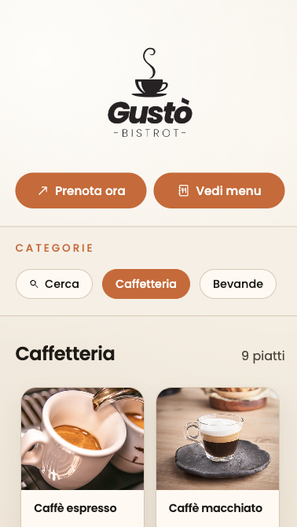
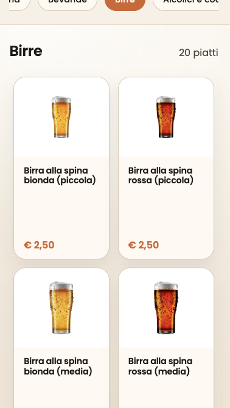
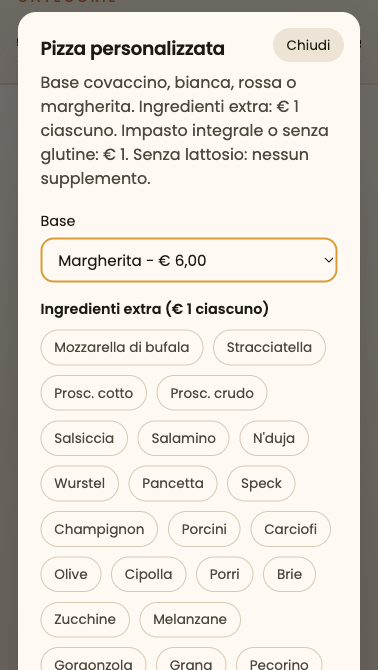

# Gustò Bistrot - digital menu - new version

A complete digital menu that works with WhatsApp to send the order. It can be used by the customers at the bistrot
directly from their table or it can be used by the waiters.

This system has been completely in full use since april 2025, and works pretty fine. This version is a refractor of the first, i modified the UX/UI to gain more and more speed and finesse.

### Digital menu that:

- Show to the users all the dishes available.

- Has a personalize Pizza modal that shows every single ingredient.

- Has gluten free and lactose free options.

- And much more... [Take a look](https://gustodonnini.com)

## Structure and porpouse

As i said before, this menu allows you and your restaurant to work much faster than before, the choice to share this menu with the customers is yours. Everything is user-friendly and very simple to use.

This menu was a request by Gustò's owner Marco, and he is very proud of this work, if you're in this zone, take a look
also at the bistrot.

Here are some screenshots:

   

The site is entirely in [HTML](index.html), using a simple [script.js](script.js) for usefull functions (such as formats, animations, WhatsApp message construct and all the ones for the modals), display the dishes in it and an external [CSS](styles.css) for the styles, very similar to my website [cenidev.com](https://cenidev.com). This project also has [menu.js](menu.js) that contains all the dishes.

## Gustò's links

- [Website](https://gustodonnini.cenidev.com)
- [Instagram](https://www.instagram.com/gustodonnini/)
- [Facebook](https://www.facebook.com/baralimentari.gusto/?locale=it_IT)

## Visit my projects

The client is very happy with this website and suggests you involve me in the creation of these websites.
If you want to see other projects, simply visit [cenidev.com](https://cenidev.com) and enjoy.

© Copyright 2026 Ceni Dev | Gustò Donnini